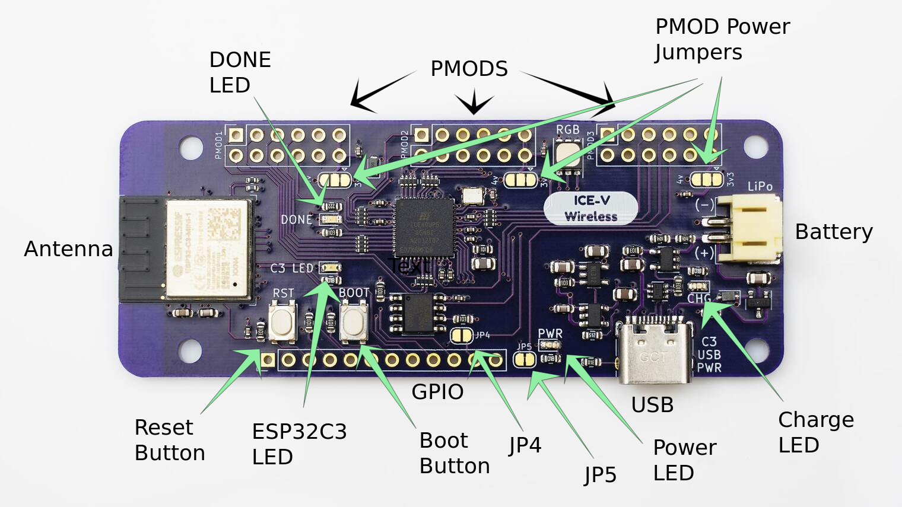

# Getting Started

If you've just gotten an ICE-V-Wireless board you may have some questions about how to use it, what all the features are and where to go to learn more about creating useful things with it. This document should help with answering those questions.

## What's on the board

- Antenna - this is the 2.4GHz RF antenna for WiFi and Bluetooth signals. Keep it well clear of metal objects for best reception.

- Reset Button - pressing this resets the board and reinitializes the ESP32C3 firmware.

- ESP32C3 LED - Blinks green to indicate operation status.

- Boot Button - Hold down while pressing the Reset button to put the ESP32C3 into bootloader mode. Can also be used without the Reset button for other firmware purposes.

- GPIO - this header provides connections to power, various ESP32C3 and FPGA signals.

- JP4 - Optional connection between FPGA pin 34 and ESP32C3 GPIO8. Allows additional signalling. Normally not connected.

- JP5 - Optional connection between battery voltage and ESP32C3 GPIO3. Allows firmware to monitor battery. Normally connected so must be cut if GPIO3 is used for other purposes.

- Power LED - lights red when 3.3V power is available.

- USB - connection to USB host for programming, communication or battery charging.

- Charge LED - lights yellow when the LiPo battery is charging. It is normal for this LED to flash quickly when no battery is connected.

- Battery - JST PH socket for connection to standard LiPo battery connector.

- PMOD power jumpers - allow selection of the supply voltage for the PMODs. Normally connected to 3.3v. Can be connected to the raw 4V by cutting a trace and soldering.

- PMODs - standard 8-bit 12-pin PMOD connectors compatible with widely available PMOD boards.

- Done LED - lights blue when the FPGA has been programmed with a valid bitstream.

## Initial Powerup

To power up for the first time simply connect a USB C cable between the ICE-V-Wireless board and either a computer or power adapter. Various LEDs will light up:

- The red Power LED should light indicating proper 3.3V supply.

- The blue DONE LED should light indicating the FPGA is configured.

- The RGB LED should cycle through rainbow colors showing the test design in the FPGA is working.

- After a few seconds the green C3 LED should flash at a slow rate of once per second indicating that the firmware is operating but not connected to a WiFi network.

- The yellow Charge LED may also flash quickly if no battery is connected.

### Operation

If you have connected to a computer you may see that a new USB serial port has opened. This can be used with the provided [Python](python) scripts to configure and control the board. Clone this repository or download the scripts and follow the documentation to get your board running on your WiFi network and begin communicating with it.

## Default Firmware

As shipped the ICE-V-Wireless board comes pre-loaded with the latest firmware from this repository which provides both WiFi and USB control options. Source code for the default firmware is found [here](Firmware). Communicating with this firmware in order to set WiFi credentials, install FPGA designs or query the running designs requires the use of several [Python](python) scripts.

### Alternative Firmware

Several other firmware packages are available:

- [WiFi Manager](https://github.com/ICE-V-Wireless/ICE-V_WiFiMgr) - this version of firmware is written using the ESP IDF and provides a soft Access Point (AP) and captive portal for configuring the WiFi credentials.

- [Arduino Firmware](https://github.com/ICE-V-Wireless/ICE-V-Arduino) - this version of the firmware is developed using the Arduino IDE and provides a soft AP and captive portal for configuring the WiFi credentials. Start here if you're more comfortable coding in the Arduino environment.

- [Micropython](https://github.com/ICE-V-Wireless/ICE-V_Micropython) - this repository provides instructions for setting up Micropython on the ICE-V-Wireless board as well as embedded Python scripts for configuring and accessing the FPGA. Start here if you prefer Python development.

## Default Gateware

The default FPGA design contains a RISC-V soft core processor and a number of peripherals to control on-board features such as the RGB LED. You can find out more about the design [here](Gateware).

### Alternative Gateware

Additional FPGA designs may be added to the ICE-V-Wireless projects group.

## Going Further

Developing your own firmware and gateware is the core reason we created the ICE-V-Wireless board so you're encouraged to study the examples and explore how you can extend them for your own projects. For questions and help with development for the ICE-V-Wireless consider joining the [QWERTY Embedded Discord](https://discord.gg/DM8xAN4Jjx) community.
