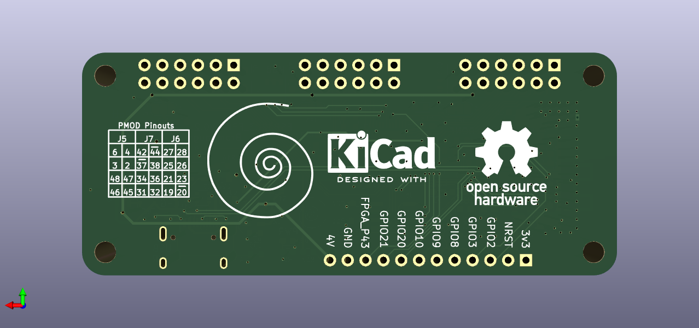
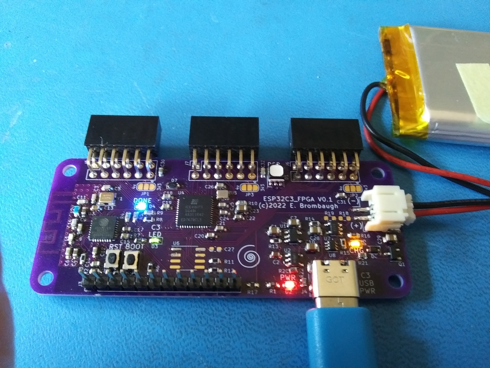

# ESP32C3_FPGA
Combined ESP32C3 and iCE40 FPGA board

## Abstract
This project combines an Espressif ESP32C3HN4 SoC (which includes 4MB of
flash in the package) with a Lattice iCE40 FPGA (either an iCE5LP4k or
iCE40UP5k or other pin an package-compatible devices) to allow WiFi and
Bluetooth control of the FPGA. ESP32 and FPGA I/O is mostly uncommitted
except for the pins used for SPI communication between ESP32 and FPGA.
Several of the ESP32C3 GPIO pins are available for additonal interfaces
such as serial, ADC, I2C, etc.

This project comprises both hardware, firmware, gateware and host-side
communication utilities.

## Hardware
The hardware design is provided as schematic and layout in KiCAD 6 format.
The design provides:
* Three standard PMOD connectors spaced to accomodate
dual-PMOD modules with all eight signal pins directly connected to the
FPGA.
* Additional I/O connector with seven ESP32C3 GPIO lines and one FPGA
line, along with power and ground connections.
* USB-C connector for power, programming and JTAG debugging.
* LiPo Battery operation and charging.
* PCB antenna for WiFi and Bluetooth.

## Firmware
The ESP32 firmware is written in C with the ESP-IDF V5.0 toolchain and
libraries. Initially it provides a TCP socket interface over WiFi with the
following features:
* Initial loading of the FPGA configuration at powerup from a SPIFFS filesystem
contained in the ESP32C3HN4 flash.
* WiFi socket-based "instant" loading of configurations direct to the FPGA.
* WiFi socket-based updating of the configuration stored in SPIFFS.
* WiFi socket-based monitor/control of the FPGA design via SPI.

## Gateware
The iCE40 FPGA gateware provided is a simple design that demonstrates basic
SPI monitor/control via SPI with a flashing LED. More advanced designs are
possible.

## Host-side Utilities
A command-line Python script is provided to communicate over TCP sockets
with the ESP32C3 which supports the features outlined in the Firmware section
above.

## Status
### 05-17-2022
PCBs from the first revision are back from the board house and I've built one
up. A few minor issues were discovered that had easy work-arounds, as well as
a bug in the firmware configuration process. All essential parts
of the project are tested out and working now and I've got the changes for a
second revision ready to roll.

### 05-24-2022
We're looking at a "community-base" upgrade to the project now. Lots of changes:
* Switching to a C3 Mini module that's pre-certified and less cost & hassle than the discrete
approach of this design.
* Revising the PMOD pinouts to support higher-performance.
* Adding source termination to all PMOD I/O to reduce EMI.
* More tweaks TBD.

Find it here:
https://github.com/mwelling/ICE-V-Wireless
