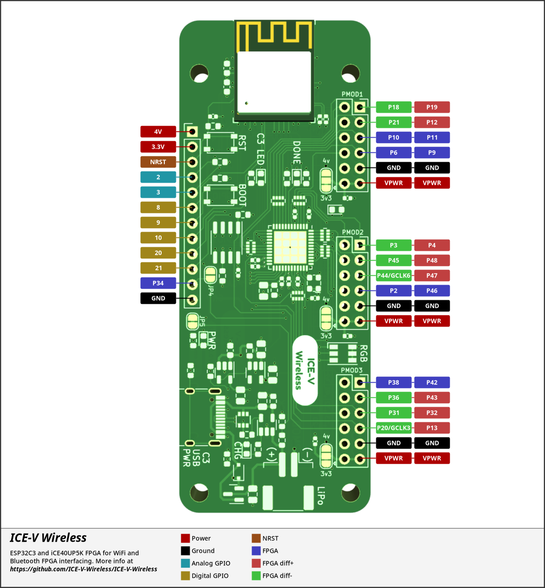

# ICE-V Wireless
Combined ESP32C3 and iCE40 FPGA board

## Abstract
This project combines an Espressif ESP32-C3-MINI-1 (which includes 4MB of
flash in the module) with a Lattice iCE40UP5k-SG48 FPGA to allow WiFi and
Bluetooth control of the FPGA. ESP32 and FPGA I/O is mostly uncommitted
except for the pins used for SPI communication between ESP32 and FPGA.
Several of the ESP32C3 GPIO pins are available for additonal interfaces
such as serial, ADC, I2C, etc.

This project comprises both hardware, firmware, gateware and host-side
communication utilities.

## Hardware
The hardware design is provided as schematic and layout in KiCAD 6 format.
The design provides:
* Three standard PMOD connectors spaced to accommodate
dual-PMOD modules with all eight signal pins directly connected to the
FPGA.
  * Many PMOD signals are available in differential pairs with the positive
and negative halves on adjacent odd/even pins.
  * PMOD power pins can be tied either to the on-board regulated 3.3V supply
(default) or to the unregulated ~4V supply (requires cutting a trace and adding
a solder blob).
* Additional I/O connector with seven ESP32C3 GPIO lines and one FPGA
line, along with power, ground and reset connections.
* 8MB PSRAM connected directly to the FPGA.
* USB-C connector for power, programming and JTAG debugging of the ESP32C3.
* Tactile buttons for reset and boot mode selection of the ESP32C3.
* RGB LED directly driven by the iCE40 FPGA
* LED indicators for power, charging, FPGA configuration and ESP32C3 software.
* LiPo Battery operation and charging.
* Onboard antenna for WiFi and Bluetooth.

### Pinout

## Firmware

The ESP32 firmware is written in C with the ESP-IDF toolchain and
libraries. It provides both a USB and a TCP socket interface over WiFi with the
following features:
* Initial loading of the FPGA configuration at powerup from a SPIFFS filesystem
contained in the ESP32C3F[H/N]4 flash. 
 (See [Page 9 of the ESP32-C3 Series Datasheet](https://www.espressif.com/sites/default/files/documentation/esp32-c3_datasheet_en.pdf#page=9)
for part number details).
* USB and WiFi "instant" loading of configurations direct to the FPGA.
* USB and WiFi updating of the configuration stored in SPIFFS.
* USB and WiFi monitor/control of the FPGA design via SPI.
* USB and WiFi monitor of LiPo battery voltage.
* USB setting of WiFi credentials (SSID and Password)

## Gateware

The iCE40 FPGA gateware provided is a simple design that demonstrates basic
SPI monitor/control via SPI with a flashing LED. More advanced designs are
possible.

## Host-side Utilities
Command-line Python scripts are provided to communicate over USB and WiFi
with the ESP32C3 which supports the features outlined in the Firmware section
above.

## Getting One
ICE-V-Wireless boards are available via the GroupGets store:
https://store.groupgets.com/products/ice-v-wireless

## Getting Started
If you've just gotten an ICE-V-Wireless board and want to quickly get going
read the [Getting Started](Getting-Started.md) page.

## Reviews and Tutorials
[Tom Verbeure](https://tomverbeure.github.io/) has generously written a great review and tutorial for the
ICE-V-Wireless board on his blog:
[An In-Depth Look at the ICE-V Wireless FPGA Development Board](https://tomverbeure.github.io/2022/12/27/The-ICE-V-Wireless-FPGA-Board.html)

You'll find a lot of additional detail and some clear step-by-step guides
for getting tools set up to build firmware and gateware for the board.

[gojimmypi](https://gojimmypi.github.io/) has a writeup on his blog from early-on in the board development
which provides some insight into ESP32 devtools and provides some helpful links:
[ICE-V Wireless FPGA with ESP32-C3](https://gojimmypi.github.io/ICE-V-Wireless-FPGA-ESP32-C3/)
